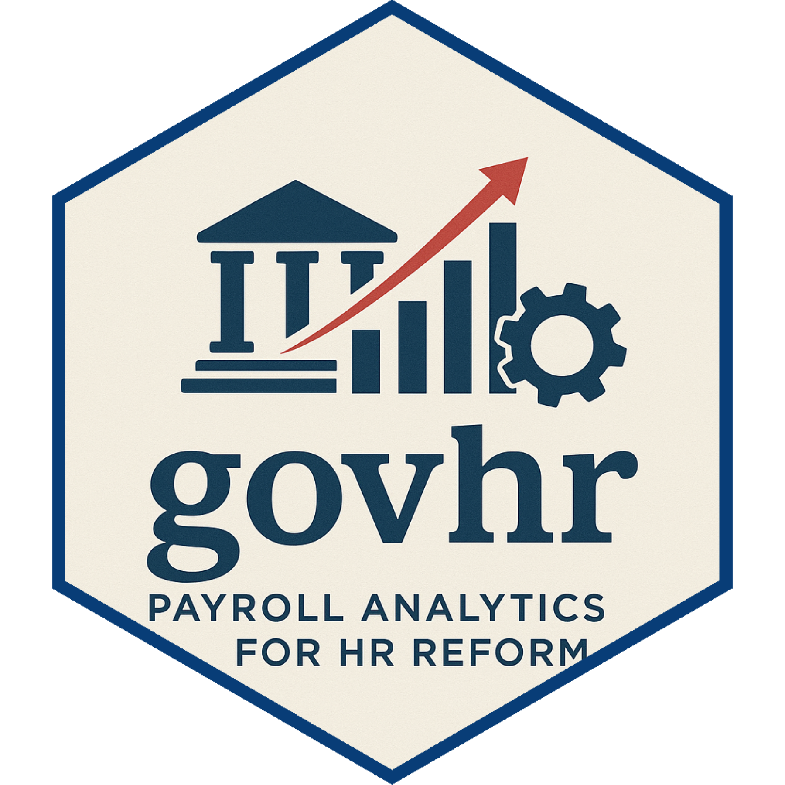

<!-- README.md is generated from README.Rmd. Please edit that file -->

# govhr </a>

<!-- badges: start -->

[](https://github.com/WB-PIDA-Data-Science-Shop/govhr/actions/workflows/R-CMD-check.yaml)
[](https://app.codecov.io/gh/WB-PIDA-Data-Science-Shop/govhr)
<!-- badges: end -->

The goal of `govhr` is to provide a set of open-source tools that:

1.  Standardize and efficiently clean human resource management
    information system (HRMIS) data.
2.  Produce analytical insights in a standard, but customizable, format.
3.  Quality assures both 1 and 2.

`govhr` is based on the [Public Sector Employment and Compensation
Assessment
Framework](https://documents1.worldbank.org/curated/en/324801640074379484/pdf/Public-Sector-Employment-and-Compensation-An-Assessment-Framework.pdf#page=37.23)
developed by the World Bank.

## Installation

You can install the development version of `govhr` from
[GitHub](https://github.com/WB-PIDA-Data-Science-Shop/govhr) with:

``` r
# install.packages("pak")
pak::pak("WB-PIDA-Data-Science-Shop/govhr")
```

## Example

This is a basic example which shows you how to solve a common problem:

``` r
library(govhr)
## basic example code
```
